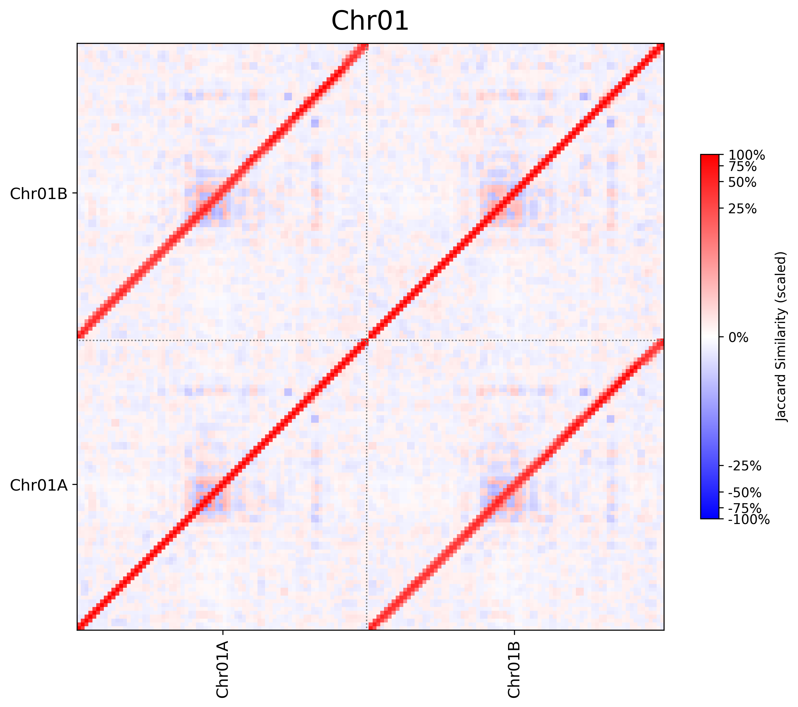

# HapJSI: A tool for calculating jaccard similarity among haplotypes regions within chromosome groups

## Introduction
HapJSI (**Hap**lotype **J**accard **S**imilarity **I**dentifier) is a tools for calculating jaccard similarity using kmers of haplotype regions with sliding windows.

## Installation
```bash
cd /path/to/install
git clone https://github.com/sc-zhang/HapJSI.git
chmod +x HapJSI/hapjsi.py
# Optional
echo 'export PATH=/path/to/install/HapJSI:$PATH' >> ~/.bash_profile
source ~/.bash_profile
```

## Usage
```bash
usage: hapjsi.py [-h] -g GENOME -l LIST [-w WINDOW] [-s STEP] [-k K] -o OUTPUT [--cmap CMAP] [--fmt FMT] [--log_scale] [-t THREADS]

options:
  -h, --help            show this help message and exit
  -g GENOME, --genome GENOME
                        Input genome file
  -l LIST, --list LIST  Haplotype group file, contain two columns: Chromosome Haplotype
  -w WINDOW, --window WINDOW
                        Window size, could be scientific notation, default=1e6
  -s STEP, --step STEP  Step size, could be scientific notation, default=5e5
  -k K                  k size of kmer, default=21
  -o OUTPUT, --output OUTPUT
                        Output directory
  --cmap CMAP           CMAP for drawing heatmap, default="RdBu_r"
  --fmt FMT             Heatmap file format, default="pdf"
  --log_scale           If set, heatmap would be scaled with log10(jaccard similarity * 100+1)
  -t THREADS, --threads THREADS
                        Threads, default=10
```
> Jaccard Similarity is defined as:  
> $$Jaccard\ Similarity=\frac{{A}\bigcap{B}}{{A}\bigcup{B}}$$  
> Where A is kmer set of sequence1, B is kmer set of sequence2

>Notice:  
>The positive Jaccard Similarity means the similarity between A and B, and the negative Jaccard Similarity means the similarity between reverse complementary kmer set of set A and the original kmer set B. 
- the list file contained tow columns: chromosome,haplotype which seperated by <kbd>tab</kbd> or <kbd>space</kbd>, like:
```text
Chr1    Chr1A
Chr1    Chr1B
Chr2    Chr2A
Chr2    Chr2B
```

## Output
- final.jac: a file with 6 columns: chromosome, haplotype1, position1, haplotpye2, position2, jaccard similarity, like below:
```text
Chr1    Chr1A       1       Chr1A       500001  0.364967
```
> Notice:  
> If the jaccard similarity is negative, that means the jaccard similarity between the first region and the reverse complementary of second region was higher than the jaccard similarity between the first region and the second region

- pic/*.pdf: heatmap for each chromosomes (the figure format depends on user setting), like below:

